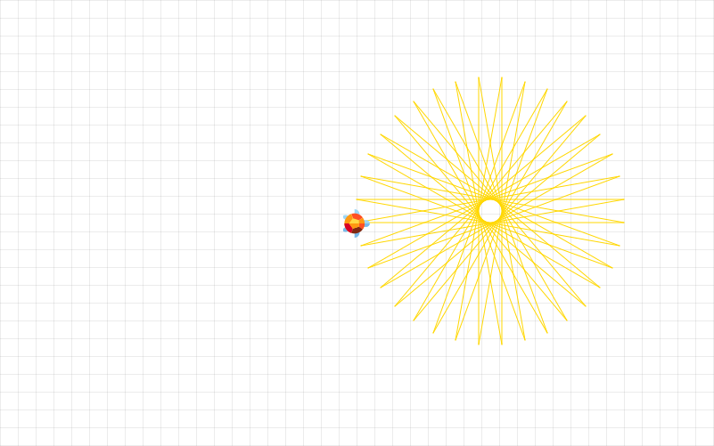

# Interactive Turtle

[](https://travis-ci.org/datarho.tech/iturtle)
[](https://codecov.io/gh/datarho.tech/iturtle)

A custom Jupyter widget for interactive turtle.

## Installation

You can install using `pip`:

```bash
pip install iturtle
```

Here is the suggested conda environment:

```bash
conda create -n turtle -c conda-forge python=3.10 jupyterlab=3.5
```

## Usage

Logo is an educational programming language, designed in 1967 by Wally Feurzeig, Seymour Papert, and Cynthia Solomon. Logo is not an acronym: the name was coined by Feurzeig while he was at Bolt, Beranek and Newman, and derives from the Greek logos, meaning word or thought.

Interactive Turtle is an implementation of Logo programming language as a Jupyter Widget for Jupyter Lab. Interactive Turtle is a popular way for introducing programming to kids and beginners.

Imagine a robotic turtle starting at the middle of the coordinate plane. After an `from iturtle import Turtle` and creating instance `t = Turtle()`, give it the command `t.forward(15)`, and it moves `15` pixels in the direction it is facing, drawing a line as it moves. Give it the command `t.right(25)`, and it rotates in-place 25 degrees clockwise.

By combining together these and similar commands, intricate shapes and pictures can easily be drawn.

For example, intricate shapes can be drawn by repeating simple moves:

```
from iturtle import Turtle

turtle = Turtle()
turtle.pencolor("gold")

for i in range(36):
    turtle.forward(300)
    turtle.left(170)
```



Please check the following samples:

- [Introduction](examples/introduction.ipynb)
- [Star](examples/star.ipynb)
- [Spiral](examples/spiral.ipynb)

Currently Interactive Turtle supports these methods:

### Turtle motion

`home()`

Move turtle to the origin – by default the middle of the coordinate plane – and set its heading to its start-orientation which is to the right (east).

```
turtle.home()
```

`forward()` or `fd()`

Move the turtle forward by the specified distance, in the direction the turtle is headed.

```
turtle.forward(20)
```

`backward()` or `bk()`

Move the turtle backward by the specified distance, in the direction the turtle is headed.

```
turtle.backward(20)
```

`left()` or `lt()`

Turn turtle left by angle units. Units are by default degrees.

```
turtle.left(90)
```

`right()` or `rt()`

Turn turtle right by angle units. Units are by default degrees.

```
turtle.right(90)
```

`speed()`

Set the turtle’s speed to an integer value in the range 0..10.

Speeds from `1` to `10` enforce increasingly faster animation of line drawing and turtle turning.

```
turtle.speed(1)
```

### Pen control

`penup()` or `pu()`

Pull the pen up – no drawing when moving.

```
turtle.penup()
```

`pendown()` or `pd()`

Pull the pen down – drawing when moving.

```
turtle.pendown()
```

`pencolor()`

Set the color of the pen.

You can set pen color to color string, which is a color specification string, such as "red", "yellow", or "#33cc8c".

```
turtle.pencolor("red")
```

You can also set pen color to the RGB color represented by r, g, and b. Each of r, g, and b must be in the range 0..255.

```
turtle.pencolor(255, 255, 255)
```

`bgcolor()`

Set background color of the turtle canvas.

You can set background color to color string, which is a color specification string, such as "red", "yellow", or "#33cc8c".

```
turtle.bgcolor("black")
```

`goto()`

Move turtle to an absolute position. If the pen is down, draw line. Do not change the turtle’s orientation.

```
turtle.goto(10, 10)
```

`teleport()`

Move turtle to an absolute position. Unlike `goto(x, y)`, a line will not be drawn. The turtle's orientation does not change.

```
turtle.teleport(20, 30)
```

## Development Installation

Create a dev environment:

```bash
conda env create -f environment.yml
```

Install the python. This will also build the TS package.

```bash
pip install -e ".[test, examples]"
```

When developing your extensions, you need to manually enable your extensions with the
lab frontend. For lab, this is done by the command:

```
jupyter labextension develop --overwrite .
jlpm run build
```

### How to see your changes

If you use JupyterLab to develop then you can watch the source directory and run JupyterLab at the same time in different
terminals to watch for changes in the extension's source and automatically rebuild the widget.

Watch the source directory in one terminal, automatically rebuilding when needed:

```bash
jlpm run watch
```

Run JupyterLab in another terminal:

```bash
jupyter lab --no-browser
```

After a change wait for the build to finish and then refresh your browser and the changes should take effect.

If you make a change to the python code then you will need to restart the notebook kernel to have it take effect.
